# مقدمة للتعرف على بيئة العمل التي سنعمل عليها وهي محاكي QtSpim MIPS

قم أولا بتثبيت المحاكي [من هنا](https://sourceforge.net/projects/spimsimulator/files/?fbclid=IwAR2UB4mMPPK8KfInX2P1T8bTCEBWC0AL6LfL8AJJHOpfr4OOppHNGnXqAj4) والضغط على Download Latest Version

في هذا المعمل سنتعرف على طريقة عمل المحاكي فقط وسنستخدم برنامج جاهز يمكنك تنزيله [من هنا](Lab1a.asm)

<br>محتويات الدرس:
<ol dir="rtl">
<li><a href="#1">ضبط المحاكي</a></li>
<li><a href="#2">شرح الواجهة</a></li>
<li><a href="#3">شرح الكود</a></li>
<li><a href="#4">شرح واجهة الـText Segment</a></li>
<li><a href="#5">تنفيذ التعليمات</a></li>
<li><a href="#6">مرجع للاستزادة</a></li>
</ol>
<br><br>

--- 
## ضبط المحاكي: <br id=1>

سنقوم بضبط بعض الإعدادات الرئيسية في المحاكي <br>
عند تشغيل المحاكي انتقل إلى Simulator في شريط القوائم ثم اختر Settings
<br>
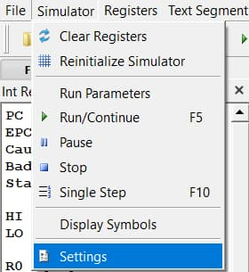

ستظهر لك نافذة QtSpim Settings
انتقل لتبويب MIPS
<ol dir="rtl">
<li> في قسم MIPS Simulations Settings اختر Simple Machine</li>
<li> وفي قسم Exception Handler أزل علامة الصح من خيار Load Exception</li>
</ol>

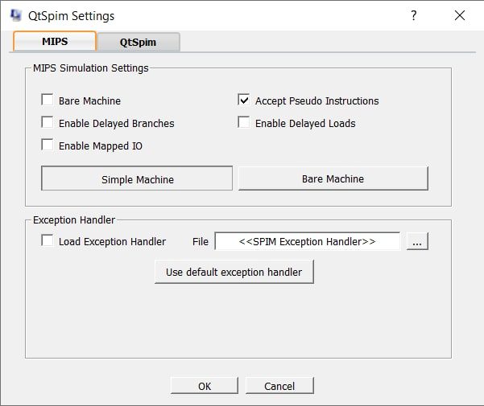<br>
ثم اضغط موافق (OK)


أيضاً انتقل إلى Text Segment وتأكد من تفعيل خيار Instruction Value
<br>
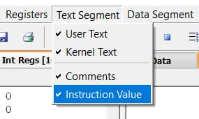

وأخيراً في Data Segment فعل فقط User Data واختر تنسيق Hex (كما موضح بالصورة)
<br>
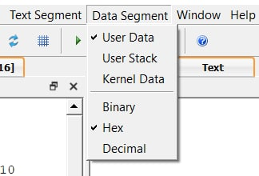


---
## شرح الواجهة: <br id=2>

الآن أعد تشغيل المحاكي لتطبيق الإعدادات
ثم انتقل إلى File واختر Reinitialize and Load File وقم باختيار الملف الذي حملته سابقاً [Lab1a.asm](Lab1a.asm)
 <br>
 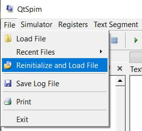

 وستكون الواجهة لديك كالتالي:
 <br>
 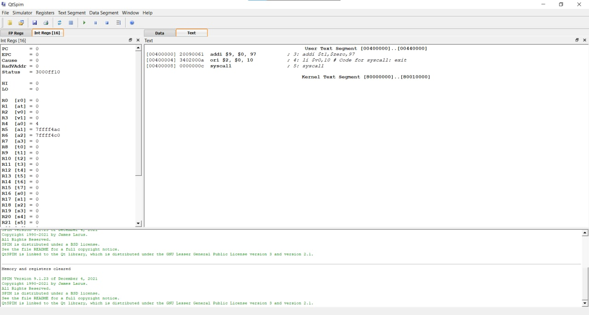

<h3>الواجهة مقسمة إلى ثلاثة أجزاء:</h3>
<ol dir="rtl">
<li> <b>Registers frame</b><br></li>
والتي تحتوي على FP Regs (floating-point unit) و Int Regs[16] سنتجاهل FP Regs وسيكون تركيزنا على Int Regs[16] والتي تحتوي على قيم الأعداد الصحيحة والسجلات الخاصة (registers) في معالج <bdi>MIPS</bdi> (MIPS CPU) <br>
<small>ملاحظة الرمز [16] يعني أن القيم المعروضة هي بالـHex
ويمكنك تغيير طريقة عرضها من قائمة Registers في شريط القوائم </small>

<li> <b>Text Segment frame</b></li>

يحتوي على تبويبين يعرض التبويب Text تعليمات البرنامج الذي اخترته
[Lab1a.asm](Lab1a.asm)
(لن تظهر جميع الأسطر في الملف مثل التعليقات في السطر المنفرد والعناوين...)
ويحتوي أيضاً على تبويب Data والذي يعرض البيانات التي تم تحميلها في البرنامج 

<li> <b>Messages frame</b><br></li>
هنا يتم عرض الرسائل والأخطاء
</ol>

لاحظ أيضاً أنه توجد نافذة منفصلة يتم عرضها وهي نافذة  Console والتي سنستخدمها في المعامل القادمة
يمكنك إظهارها من قائمة Window في شريط القوائم
<br>
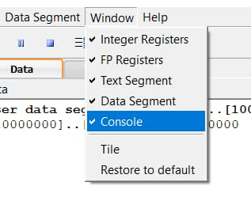

---
## شرح الكود: <br id=3>

الآن بعد أن تعرفنا على واجهة البرنامج سنتعرف الكود الذي كتبناه

```Assembly
# Lab1a.asm
    .text
main:   addi $t1,$zero,97
        li $v0,10 # Code for syscall: exit
        syscall
```
أول سطر هو تعليق لأنه مسبوق بعلامة #
```
# Lab1a.asm
```
السطر الثاني يحدد عنوان بداية التعليمات البرمجية (source code)
```
.text
```
إذا لم نحدد عنوان البداية فسيتم افتراض قيمة افتراضية ( 0x00400000) في المعمل القادم سنحدد قيمة معينة للبدء

تأكد من أن القيمة الافتراضية هي 0x00400000 من أجل تجنب وقوع أخطاء أثناء تشغيل البرنامج
توجه للقائمة Simulator واختر Run Parameters
<br>
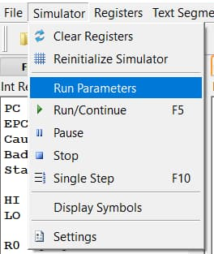

وتأكد من وضع القيمة 0x00400000 في الخانة Address or label to start running program
<br>
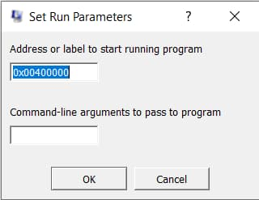

في السطر الثالث تم وضع عنوان `main` والعنوان يكون متبوع بنقطتين رأسيتين `:` ويمكن وضعه قبل السطر المراد تحديده
```
main:
addi $t1,$zero,97
```

والتعليمة <bdi>`addi`</bdi> ستجمع قيمة صريحة <bdi>(`97`)</bdi> على سجل معين <bdi>(`$zero`)</bdi> وتضع النتيجة في السجل المحدد <bdi>(`$t1`)</bdi>
فمعنى السطر أنه سيحسب نتيجة العملية 97+0 ويخزنها في t1

القيمة الصريحة سيتم التعامل معها افتراضياً بالـdecimal وفي حال الرغبة بوضع قيمة hexadecimal يكون مسبوق بـ0x
مثلاً لتمثيل السطر السابق بالـhexadecimal سيكون كالتالي:
```
addi $t1,$zero,0x61
```

آخر سطرين هي للخروج من البرنامج وستكون موجودة في جميع البرامج القادمة
سيتم شرحها في الدروس القادمة
```
li $v0,10 # Code for syscall: exit
syscall
```

--- 
## شرح واجهة الـText Segment <br id=1>
يبدو أنك لاحظت وجود أربع أعمدة لكل سطر في الـText Segment 
<br>
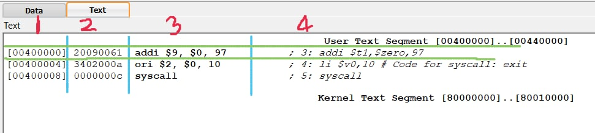

| العمود الأول  | العمود الثاني | العمود الثالث | العمود الرابع (بعد الفاصلة)
| :---: | :---: | :---: | :---: | 
| `[00400000]`  | `20090061`  | `addi $9, $0, 97`  | `; 3: addi $t1,$zero,97`  |
| هو موقع التعليمة في الذاكرة (address)  | هو التعليمة مشفرة بالـhexadecimal  | هو الكود الأصلي في MIPS  | هو مصدر الكود الذي كتبته (source code) مسبوق برقم السطر في الملف الأصلي  |

> بعض الأحيان العمود الرابع بعد الفاصلة يكون فارغاً وهذا يعني أن التعليمة التي كتبتها (pseudo-instruction) تم ترجمتها إلى أكثر من تعليمة حقيقية (real MIPS instruction)

> لاحظ أن العمود الأول يبدأ من القيمة الافتراضية 0x00400000

--- 
## تنفيذ التعليمات <br id=5>
الآن وقت تنفيذ التعليمات

توجد طريقتين:
<br>
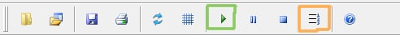
<ol dir="rtl">
<li>Run/Continue</li>
تقوم بتشغيل جميع التعليمات حتى نهاية البرنامج أو عند حدوث خطأ
<li>Single Step</li>
تقوم بتنفيذ تعليمة واحدة فقط في كل مرة يتم الضغط عليها
</ol>

لاحظ عند التنفيذ بأحد الطريقتين سيتغير لون السجلات التي تم تغييرها باللون الأحمر في نافذة Registers frame ويمكنك رؤية قيمتها الحالية

ودائماً ستكون قيمة السجل PC هي عنوان التعليمة التالية التي سيتم تنفيذها

يمكنك تعيين قيمة مباشرة لسجل معين بالضغط بالزر الفأرة الأيمن واختيار Change Register Contents
<br>
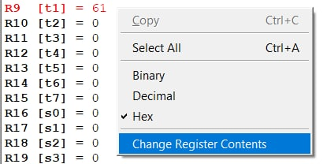
<br>
 وثم وضع قيمة لها إما بالـHexadecimal أو بالـDecimal
 <br>
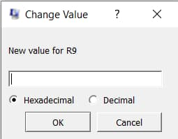

---
## مرجع للاستزادة <br id=6>
تعرفنا في هذا الدرس على واجهة المحاكي وطريقة عمله
ويمكنك التعرف عليه أكثر من هنا 
[MIPS Assembly Language Programming using QtSpim](http://www.egr.unlv.edu/~ed/MIPStextSMv11.pdf)