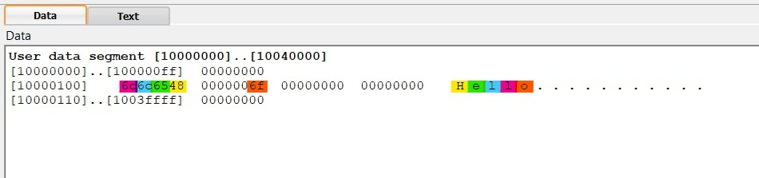
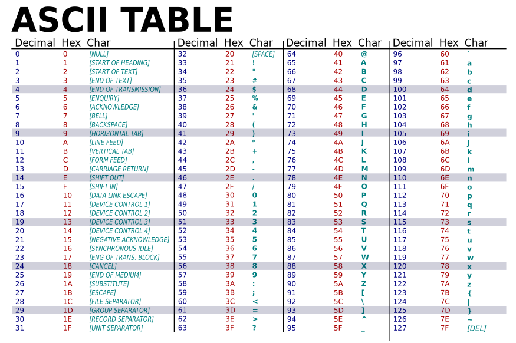

<head><style>img {background-color: #FFFFFF;}</style></head>

# استدعاء النظام (syscall) وطباعة الرسائل في QtSpim MIPS

سنتعرف في هذا الدرس طريقة طباعة رسالة في الـConsole

أولاً قم بتحميل الملف [من هنا](Lab1b.asm)

<br>محتويات الدرس:
<ol dir="rtl">
<li><a href="#1">الموجهات (assembler directives)</a></li>
<li><a href="#2">شرح الكود</a></li>
<li><a href="#3">طريقة التخزين في الذاكرة</a></li>
</ol>
<br><br>


--- 
## الموجهات (assembler directives): <br id=1><br>
```Assembly
# Lab1b.asm
      .data 0x10000100
msg:  .asciiz "Hello"
      .text
main: li $v0, 4 
      la $a0, msg
      syscall	
      li $v0,10 
      syscall
```
لاحظ في الملف أن هناك ثلاث اسطر تبدأ بنقطة هي `.data` و `.asciiz` و `.text`

هذه مجرد توجيهات (assembler directives) تخبر الـassembler بكيفية ترجمة البرنامج ولكنها لا تنتج أي تعليمات للآلة<br><br>

```
.data 0x10000100
```
الموجه `.data` يحدد عنوان البداية (`0x10000100`) وإذا لم يتم تحديده ستكون القيمة الافتراضية هي (0x00400000)<br><br>

```
msg:  .asciiz "Hello"
```
الموجه `.asciiz` يخزن في الذاكرة سلسلة نصية (String) منتهية بحرف فارغ (صفر) <br>
على عكس الموجه `.ascii` الذي يخزن السلسلة بدون حرف فارغ في نهايتها

والـ`msg:` هي عبارة عن تسمية (Label) لهذا السطر<br><br>

```
.text
```
الموجه `.text` يحدد بداية التعليمات (pseudo-instructions)

نبدأ بكتابة التعليمات الخاصة بنا بعد الموجه `.text`
<br><br>


كما يوجد موجهات أخرى مثل `.global` للإعلان عن Label معين أنه عام ويمكن استخدامه من ملفات أخرى

وأيضاً موجه `.word` لتخزين كميات <bdi>n</bdi> <bdi>32-bit</bdi> في وورد متتالية في الذاكرة<br><br>

---
## شرح الكود: <br id=2><br>

السطرين:
```
li $v0, 4 
la $a0, msg
```
هما (pseudo-instructions)<br>
التعليمة الأولى (load immediate) لتخزين قيمة صريحة (`4`) في سجل معين (`v0`)<br>
والتعليمة الثانية (load address) تخزن عنوان معين (`msg`) في سجل معين (`a0`)
> لاحظ `la` تخزن العنوان address وليس محتويات العنوان<br>

واتبعنا هذه التعليمتين بالتعليمة:
```
 syscall
```

ومعنى هذه الثلاث أسطر كالتالي:<br>
تقوم التعليمة `syscall` بإجراء استدعاء للنظام (System call) والقيمة المخزنة في السجل (`v0`) هي التي ستحدد نوع الاستدعاء

مثلا هنا القيمة 4 تعني (print_string call) طباعة سلسة نصية 

والسلسة التي سيتم طباعتها يجب أن نضع عنوان بدايتها في السجل (`a0`) لذلك وضعنا عنوان الـ`msg` لطباعة كلمة Hello في الـConsole
> نحن استخدمنا asciiz لتخزين السلسة النصية Hello أي أنه سيتبعا بحرف فارغ (صفر) لذلك عند الطباعة سيذهب للعنوان ويطبع كل حرف من السلسة إلى أن يجد الصفر
<br><br>

ونفس الشيء بالنسبة للسطرين الأخيرين 
```
li $v0,10 
syscall
```
تم وضع القيمة 10 في (`v0`) والتي تعني (exit call)

الآن عند الضغط على Run/Continue سيتم طباعة Hello في نافذة الـConsole

> (إذا لم تظهر النافذة راجع أول درس لمعرفة طريقة عرضها من القائمة Window)

<br>

---
## طريقة التخزين في الذاكرة: <br id=3><br>

لمعرفة طريقة تخزين الـString في الذاكرة توجه لتبويب Data في الـText Segment frame ولاحظ كيف يتم تخزين كل حرف في بايت واحد بشكل Hex بناء على جدول ASCII TABLE




معلومة: لاحظ بالجدول أنه بين كل حرف small و capital الفرق بينهم هو 32 أي (0x20)



وهذا مفيد في التحويل بين الحروف الكبيرة والصغيرة وأيضاً مفيد في ترتيب الحروف تصاعدياً أو تنازليا
مثلاً لتحويل حرف الـo إلى O يمكننا إحضاره من الذاكرة وتعديله وتخزين القيمة الجديدة كالتالي:
```
lb $t0, 0x10000104
addi  $t0, $t0, -0x20
sb $t0, 0x10000104
```
حيث `lb` يعني (load byte) أي يخزن قيمة العنوان المعطى في سجل معين

و `sb` تعني (store byte) أي يخزن في العنوان المعطى للذاكرة قيمة سجل معين

> (القيمة `0x10000104` تشير لمكان حرف o لأنه البايت الخامس من القيمة التي بدأنا منها 0x10000100)

