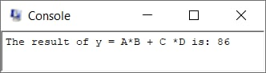
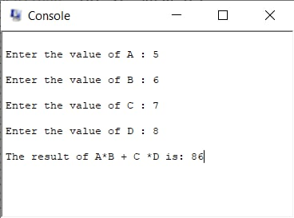

# العمليات الحسابية على الأعداد الصحيحة

في هذا الدرس سنطبق العملية الحسابية التالية:<br>
`y = A * B + C * D`

حيث:
```
y = $s0 
A = $s1
B = $s2
C = $s3
D = $s4
```

<br>سنطبق العملية الحسابية بثلاث طرق:
<ol dir="rtl">
<li><a href="#1">الطريقة الأولى: تعيين قيم صريحة</a></li>
<li><a href="#2">الطريقة الثانية: جلب القيم من الذاكرة</a></li>
<li><a href="#3">الطريقة الثالثة: الطلب من المستخدم إدخال القيم</a></li>
</ol>
<br><br>


--- 
## الطريقة الأولى: تعيين قيم صريحة: <br id=1><br>
في الطريقة الأولى سنعين قيم صريحة للسجلات ولنفرض أنها كالتالي:
```Assembly
li $s1, 5  # assgining A to 5
li $s2, 6  # assgining B to 6
li $s3, 7  # assgining C to 7
li $s4, 8  # assgining D to 8
```
يمكننا أيضاً تعيين قيمة عن طريقة التعليمة `addi` كالتالي:
```
add $s1,$zero,5 
```

لحساب عملية الضرب سنستخدم التعليمة `mul`
```
mul $t1, $s1, $s2  # t1=A*B
mul $t2, $s3, $s4  # t2=C*D
```
الآن ناتج عملية ضرب A*B مخزن في `t1`<br>
وناتج عملية ضرب C*D مخزن في `t2`

سنجمع القيمتين في `t1` و `t2` ونعين النتيجة في y=s0
```
add $s0, $t1, $t2  # y=t1+t2
```
الآن نريد طباعة قيمة `s0` مسبوقاً برسالة لذلك سنضع في بداية الملف نص الرسالة كالتالي:
```
.data 0x10000100
msg:  .asciiz "The result of y = A*B + C *D is: "
```
الآن لطباعة الرسالة سنضع في `v0` القيمة `4` ونضع في `a0` عنوان الرسالة (كما تم شرحه في المعمل السابق)
```
li $v0, 4
la $a0, msg
syscall
```
ولطباعة القيمة بعد الرسالة نضع القيمة 1 في `v0` لطباعة قيمة معينة
ونضع القيمة المراد طباعتها في `a0`
```
li $v0, 1
add $a0, $zero, $s0
syscall
```
ولا ننسى وضع سطر الخروج من البرنامج:
```
li $v0,10
syscall
```
وستظهر النتيجة في الـconsole كالتالي:
```
The result of y = A*B + C *D is: 86
```


وهكذا سيكون شكل الملف النهائي [lab2a](Lab2a.asm)

<br>

---
## الطريقة الثانية: جلب القيم من الذاكرة: <br id=2><br>
في الطريقة الثانية القيم ستكون مخزنة في الذاكرة وسنجلبها ونطبق عليها العمليات ثم نخزن الناتج في الذاكرة

في البداية ستكون القيم مخزنة كالتالي:
```
.data 0x10000100
msg:  .asciiz "The result of y = A*B + C *D is: "
A: .word 5
B: .word 6
C: .word 7
D: .word 8
```

ثم سنجل قيمهم باستخدام التعليمة <bdi>`lw`</bdi> (load word)
```
.text
lw $s1, A  # assigning A to s1
lw $s2, B  # assigning B to s2
lw $s3, C  # assigning C to s3
lw $s4, D  # assigning D to s4
```

وباقي التعليمات ستكون نفس الطريقة الأولى سنطبع الرسالة ثم القيمة ثم كود الخروج وستظهر النتيجة في الـconsole

وهكذا سيكون شكل الملف النهائي [lab2b](Lab2b.asm)

<br>

---
## الطريقة الثالثة: الطلب من المستخدم إدخال القيم: <br id=3><br>

في الطريقة الثالثة لن يتم تعيين قيم جاهزة وإنما سيتم طلبها من المستخدم ليدخلها من الـconsole

وفي هذه الحالة لاستقبال المدخلات سنستخدم `syscall` مع وضع القيمة 5 في `v0` وسيتم إرجاع القيمة المدخلة في `v0`

إذاً سنحتاج لعرض رسالة للطلب من المستخدم إدخال قيمة<br>
سنجهز رسالة لطلب كل قيمة بالإضافة إلى رسالة طباعة الناتج كالتالي:
```
.data 0x10000100
A:  .asciiz "\nEnter the value of A : "
B:  .asciiz "\nEnter the value of B : "
C:  .asciiz "\nEnter the value of C : "
D:  .asciiz "\nEnter the value of D : "
msg:.asciiz "\nThe result of A*B + C *D is: "
```
وبعدها سنطبع رسالة A وننتظر من المستخدم إدخال القيمة كالتالي:
```
.text
la $a0, A
li $v0, 4
syscall
li $v0, 5
syscall
```
> تذكر القيمة 4 في v0 لطباعة رسالة والقيمة 5 لانتظار إدخال من المستخدم

سيتم تخزين القيمة التي أدخلها المستخدم في `v0`<br>
لذلك سننسخها إلى سجل أخر قبل طلب قيمة أخرى من المستخدم
يمكن النسخ باستخدام التعليمة `add` كالتالي:
```
add $s1, $v0, $zero
```
أو باستخدام التعليمة `move` كالتالي:
```
move $s1,$v0
```
> كلا التعليمتين ستنسخ القيمة في v0 إلى s1

هكذا حصلنا على قيمة A من المستخدم سنكرر نفس الخطوات لباقي المتغيرات (B,C,D في s2,s3,s4)

ثم سنكمل باقي التعليمات بنفس الطريقة الأولى بضرب A*B و C*D ثم جمع ناتج العمليتين

وعند تشغيل البرنامج سيكون شكل الـconsole كالتالي:<br>


وهكذا سيكون شكل الملف النهائي [lab2c](Lab2c.asm)

> لاحقاً سنتطرق للـsubroutine لتجنب تكرار الأوامر بهذه الطريقة